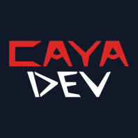

  <strong>CaYaDev</strong>

### Building developer tools, creative software and interactive technologies.

[Website](https://cayadev.com) ·
[Labs](https://labs.cayadev.com) ·
[GitHub Labs](https://github.com/CaYaDevLabs)

---

## About

CaYaDev is an independent technology initiative focused on building useful,
creative and experimental software.

This organization contains our official and actively maintained projects.
Early-stage prototypes and research experiments are published under
[CaYaDev Labs](https://github.com/CaYaDevLabs).

## What We Build

- Developer tools and automation
- AI integrations and MCP projects
- Creative software
- Interactive applications and games
- Hardware and software experiments

## Projects

Our projects will be listed here as they are released.

<!--
Example:

### Featured Projects

- **[Project Name](repository-link)**  
  Short description of the project.

- **[Project Name](repository-link)**  
  Short description of the project.
-->

## CaYaDev Labs

Experimental projects, prototypes and early-stage ideas are developed at:

**[github.com/CaYaDevLabs](https://github.com/CaYaDevLabs)**

## Links

- Website: [cayadev.com](https://cayadev.com)
- Experiments: [labs.cayadev.com](https://labs.cayadev.com)
- Founder: [@CaYatur](https://github.com/CaYatur)

---

© CaYaDev

